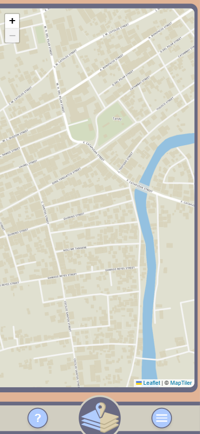
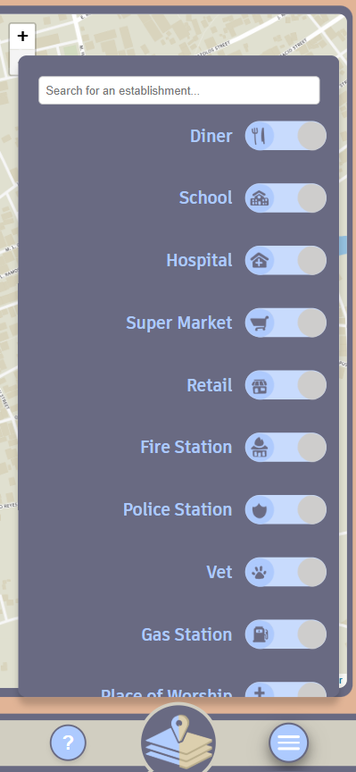
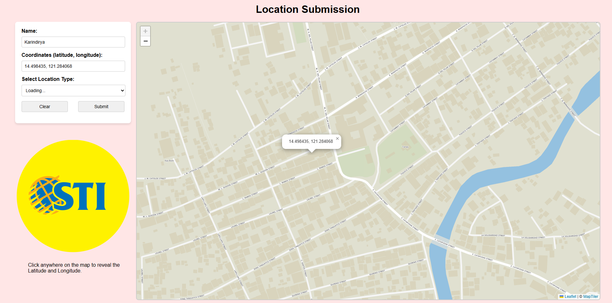

# **🐝 TanayMapper**

**Interactive map of Tanay, Rizal** — showcasing points of interest with location data stored in MongoDB.  
A project created to help locals and visitors explore Tanay in a visual, user-friendly way.

---

## 🌼 **Preview**

  
  

  

  

  

  

---

## ✨ **Features**
- 🗺️ Displays real-time locations from MongoDB
- 📍 Interactive zoom, pan, and location markers
- 📱 Mobile-friendly responsive design

---

## 🛠 **Admin Panel**
The Admin Panel is a separate Node.js application for TanayMapper, designed for administrators to easily manage the map’s data.  

**Purpose:** Allows admins to quickly add new locations directly into the MongoDB database without manually editing the data.  

**How it works:** Runs locally, providing a simple form-based interface where location details can be submitted and stored.  

---

## 🛠 **Tech Stack**
- **Frontend:** HTML, CSS, JavaScript, Leaflet.js  
- **Backend:** MongoDB (Database), Node.js
- **Tools:** GitHub Pages
